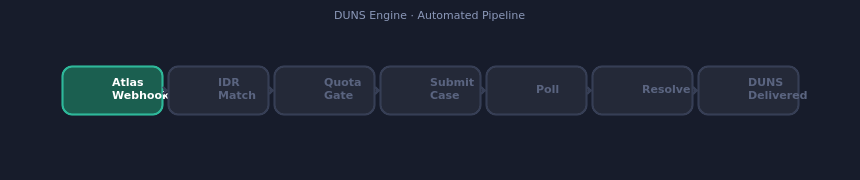
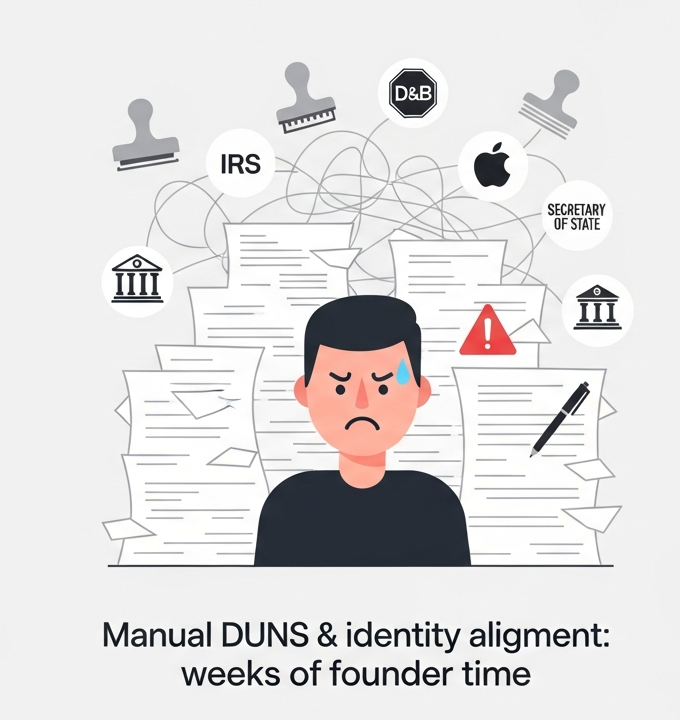
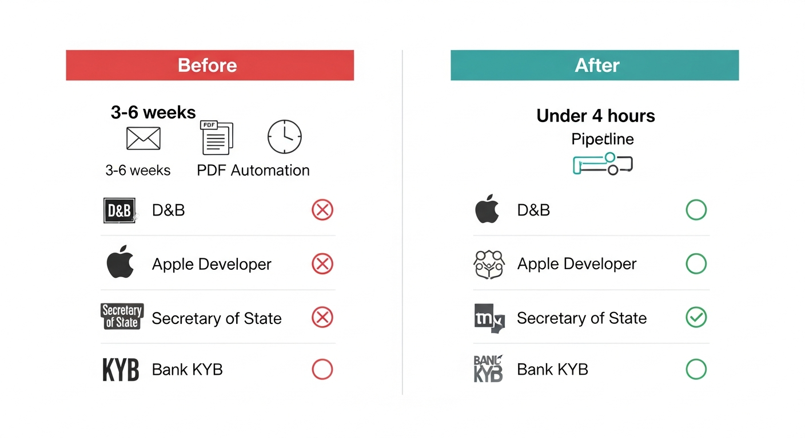

# DUNS Engine

Automates Dun & Bradstreet number acquisition for newly-incorporated companies. Handles identity deduplication, per-country quota, async polling, and a full audit trail. Runs in demo mode without D&B credentials — drop in real credentials and the full pipeline goes live.

---



---

## The problem

After a company incorporates, every downstream service — D&B, Apple Developer, Secretary of State, bank KYB — needs consistent identity data. Getting a DUNS is just the first step. The real pain is keeping address and entity data aligned across all of them.



Atlas is the source of truth at incorporation. DUNS is one API call. The harder, more valuable product is keeping entity identity aligned across registries after the company is born.

---

## Before vs. after



---

## How it works

```
Atlas webhook → IDR match → Quota gate → Submit case → Poll + resolve → DUNS delivered
```

**IDR match** — runs the entity through D&B Identity Resolution before touching quota. Confidence ≥ 8 means the DUNS already exists; the case closes immediately without burning a research slot.

**Quota gate** — D&B caps research submissions at 25/country/day. Requests that hit the cap are queued and drain automatically the next day. Quota reservation and case transition happen in one transaction so the cap is never silently exceeded.

**Submit + poll** — D&B has no webhooks for Research API results, so the worker submits a case and polls for resolution. The worker is lease-based and restartable: in-flight cases resume on restart with no duplicate submissions.

**Audit trail** — every status transition is timestamped. The dashboard shows case history, match confidence, DUNS number, and error detail on failure.

---

## Stack

- Node.js 24, TypeScript 5.9
- Express 5 (REST + webhook endpoint)
- PostgreSQL + Drizzle ORM
- React 19 + Vite (operations dashboard)
- pnpm workspaces

---

## Running locally

**Prerequisites:** Node.js 20+, pnpm, PostgreSQL

```bash
pnpm install
pnpm --filter @workspace/db run push        # apply schema
pnpm --filter @workspace/api-server run dev   # API on :8080
pnpm --filter @workspace/duns-engine run dev  # dashboard
```

**Environment variables:**

| Variable | Required | Notes |
|---|---|---|
| `DATABASE_URL` | Yes | PostgreSQL connection string |
| `ATLAS_WEBHOOK_SECRET` | Production | HMAC-SHA256 signing secret for incoming webhooks (same scheme as Stripe). Required in production; omit in dev to use the demo endpoint. |
| `DEMO_MODE` | No | Set to `false` to disable demo/simulate endpoints. On by default. |

---

## Demo mode

With `ATLAS_WEBHOOK_SECRET` unset, a `/v1/demo/simulate-webhook` endpoint fires synthetic Atlas events so you can walk the full pipeline without production credentials. The dashboard auto-refreshes every 8 seconds and pipeline stages light up as cases move through them.

To wire in real D&B Direct+ credentials: set `ATLAS_WEBHOOK_SECRET` and implement the two D&B API calls in the worker (marked in the source). The durability, quota, and retry logic are already in place.
